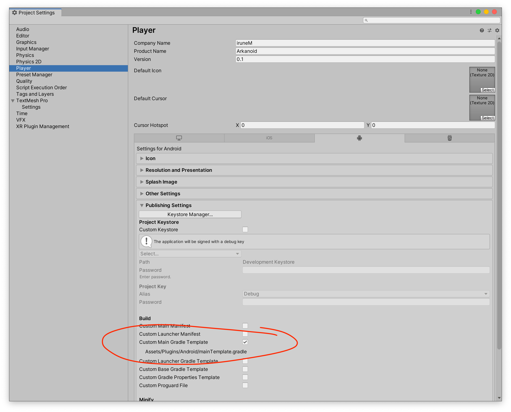
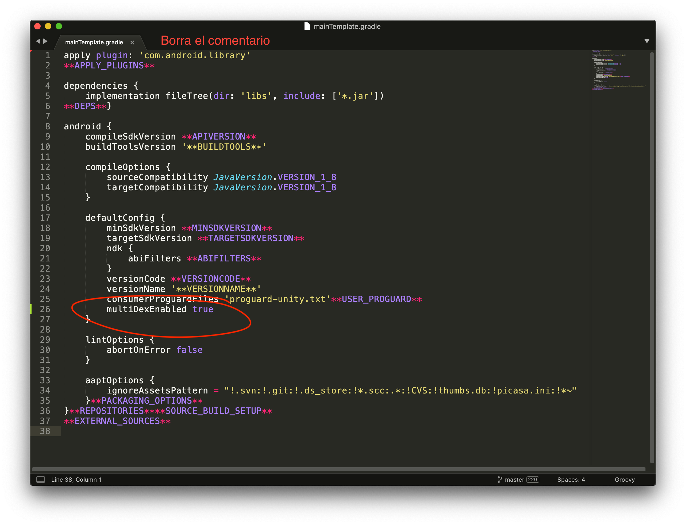

# unity-multidex

1. Actualizar Unity a la versión `2019.3.14` como mínimo (instalar `Android Build Support` incluyendo `Android SDK & NDK Tools` y `OpenJDK`).

2. Ir a `Edit → Project Settings → Player → Android → Publishing Settings → Build`.

3. Marcar la opción `Custom Main Gradle Template` y se generará el archivo en la carpeta `Assets`.

  

4. Editar el archivo `Assets/Plugins/Android/mainTemplate.gradle`, borrar el comentario del principio y habilitar la opción multiDex:

  

Referencia: [Habilitar MultiDex en un proyecto Unity](https://appmediation.com/unity-enable-multidex/).
